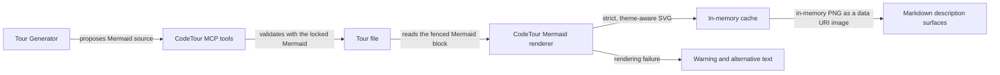

# Render Mermaid diagrams within CodeTour

CodeTour stores Mermaid source in fenced `mermaid` blocks inside a Tour's existing Markdown descriptions and renders diagrams itself, without requiring another VS Code extension or committing generated images. The Tour Generator's MCP tools validate Mermaid before writing a generated Tour, using the same exact, locked Mermaid version and diagram rules as playback. During playback, CodeTour renders with strict security, disables interactive links and HTML, and adapts the result to the active theme: Mermaid produces a theme-aware SVG internally, which CodeTour sanitizes as defense in depth and rasterizes in memory. Native comments transport the diagram as a `data:image/png;base64` image in the final Markdown, because SVG data URIs and in-memory filesystem URIs did not display as images in native comments. A rendering failure shows a compact warning and the diagram's alternative text without exposing its source, and no generated SVG or PNG file is ever written.

A Mermaid Diagram is introduced by a visible Markdown caption of the form `**Diagram — …**`, which also provides its alternative text. The first version accepts `flowchart`, `sequenceDiagram`, `stateDiagram-v2`, `classDiagram`, and `erDiagram`. A single Markdown description may contain at most three diagrams, and each Mermaid source may contain at most 20 KB. Changing the active VS Code theme invalidates the render cache, immediately refreshes the visible Tour step and Tour tree, and leaves other diagrams to be regenerated on demand. Diagrams in the same description render independently, so one failure does not hide successful diagrams. Mermaid fences are excluded from CodeTour's existing `Insert Code` transformation.

Packaging must account for the rasterizer's native code: `@resvg/resvg-js` ships platform-specific binaries, so the webpack build externalizes it and requires it at runtime, a dependency-free VSIX omits it entirely, and naively including its dependency tree produced a ~38 MB / 9,104-file package. Deliberate per-platform packaging of the rasterizer is therefore deferred to its own decision.

