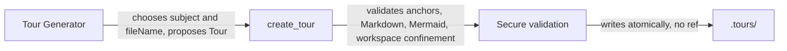

# Expose a single create_tour tool

The MCP server exposes one generic tool, `create_tour`, instead of the
specialized `create_project_tour` and `create_changes_tour` tools. The Tour
Generator chooses the Tour's subject, analyzes the relevant workspace state
itself (Git or otherwise), and provides the output file name; the server keeps
only the responsibilities of validation, security, and persistence. This
removes a category split that the server had no need to enforce and lets every
strategy — a whole-project visit, a branch review, or anything else — be driven
by the model's instructions rather than by a server-defined tour type.

## Public contract

`create_tour` accepts exactly `fileName` (required), `title` (required),
`description` (optional), and `steps` (required, non-empty). There is no `ref`,
no `mode`, and no Git parameter. Any unknown field — including `ref`, `baseRef`,
`headRef`, and `includeUncommittedChanges` — is rejected so the contract stays
strict.

The Tour is persisted under `.tours/<fileName>`. The `fileName` must be a bare,
non-empty base name ending in `.tour`; `.`, `..`, absolute paths, and `/` or `\`
separators are refused. The server neither normalizes nor silently renames the
provided name, and an existing file with that name is replaced atomically.

## Preserved guarantees

The single tool keeps every guarantee the two tools previously provided:

- aggregation of all parameter and step errors into one response;
- Tour Anchor validation and workspace confinement (real-path resolution,
  symlink escape rejection);
- rejection of active Markdown URI schemes;
- Mermaid validation using the same locked engine and rules as playback;
- a non-blocking warning when a Tour exceeds fifteen steps;
- preservation of the previous file when a proposal is invalid.

## Removed Git logic

The server no longer performs any Git access. `create_project_tour` and
`create_changes_tour` are removed without aliases; the Git-specific parameters,
warnings (`UNCOMMITTED_CHANGES_EXCLUDED`, `UNCOMMITTED_CHANGES_INCLUDED`,
`NO_CHANGED_FILE_ANCHOR`), and error codes (`GIT_REPOSITORY_REQUIRED`,
`STALE_HEAD`, `INVALID_BASE_REF`, `NO_CHANGES`) are gone, and the Git module is
deleted because it has no remaining caller. The server never writes a CodeTour
`ref` property; when a reference is relevant, deciding and recording it is the
Tour Generator's responsibility.

## Transition

There is no temporary compatibility with the removed tools, no automatic cleanup
of Tours in user projects, and no history or suffix added on overwrite. The
strategies previously named "Project Tour", "Changes Tour", and others are now
exclusively model instructions; `CONTEXT.md` keeps only the **Tour**, **Tour
Anchor**, and **Tour Generator** terms. This decision supersedes
[ADR-0001](0001-expose-two-specialized-tour-generation-tools.md),
[ADR-0002](0002-use-stable-generated-tour-files.md), and
[ADR-0004](0004-use-different-git-reference-policies-by-tour-type.md), which are
now obsolete.

